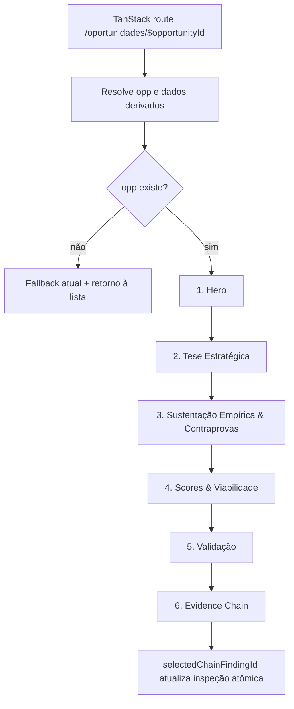

# Opportunity Detail Hierarchy Design

**Spec**: `.specs/features/opportunity-detail-hierarchy/spec.md`  
**Status**: Draft

---

## Architecture Overview

A Etapa 5B.6 altera somente a composição JSX de `OpportunityDetailView`. A resolução da oportunidade, todas as derivações, o estado local da Evidence Chain e os elementos visuais existentes permanecem no mesmo componente. A implementação futura moverá cada bloco exatamente uma vez para uma sequência linear de seis zonas, sem criar componentes, dados, cálculos, rotas ou estado novos.



### Chosen Approach

**Reordenação in-place com agrupamento mínimo.** Os blocos atuais serão recortados de suas posições e inseridos, sem cópia, na ordem aprovada. O grid tardio “Opportunity Card Details” será desfeito apenas no nível que hoje acopla Tese Estratégica e Scores: o card esquerdo torna-se a segunda zona e a pilha direita torna-se a quarta. Dores e Contraprovas continuam adjacentes e na ordem atual dentro da terceira zona; Kill Criteria e Experimentos preservam seu grid na quinta; a Evidence Chain completa é movida para o final.

As zonas devem ser landmarks semânticos de primeiro nível no DOM, preferencialmente `<section aria-labelledby="...">`, utilizando os headings visíveis existentes como rótulos. Quando um heading existente for `h3`, ele poderá receber `id` sem mudar texto ou estilo. Não serão adicionados headings visíveis apenas para satisfazer testes. A ordem será testada pelos landmarks/headings observáveis, não por classes Tailwind ou detalhes internos.

### Rejected Alternatives

| Alternative | Why Rejected |
| ----------- | ------------ |
| Extrair seis novos componentes | Aumenta superfície de mudança, exige novos contratos de props e pode deslocar estado/handlers sem necessidade para uma alteração de hierarquia. |
| Duplicar os blocos na nova posição e remover depois | Cria risco de renderização duplicada, IDs semânticos repetidos e divergência temporária de valores ou handlers. |
| Reescrever a Tese Estratégica | Viola o escopo: os campos, textos, estados vazios e regras atuais são canônicos. |
| Derivar scores das evidências ao reorganizar | Contraria a metodologia: Opportunity Score e Confidence Score são valores atribuídos, e Evidence Level é um indicador distinto. |
| Controlar a ordem com CSS `order` | Produziria divergência entre ordem visual, DOM, foco e leitores de tela, além de variar por breakpoint. |

---

## Code Reuse Analysis

### Existing Components and Utilities to Leverage

| Component / utility | Location | How to use |
| ------------------- | -------- | ---------- |
| `OpportunityDetailView` | `src/components/views/OpportunityDetailView.tsx` | Reordenar seus blocos JSX no próprio componente, preservando hooks e derivações. |
| `EvidenceLevelBadge` e `EvidenceNatureBadge` | `src/components/common/Badge.tsx` | Manter instâncias e props atuais no Hero, Scores, Dores e Contraprovas. |
| `SimulacaoTag` | `src/components/common/SimulacaoBadge.tsx` | Preservar no Hero sem alteração. |
| `ROUTES.OPORTUNIDADES` | `src/navigation/routeMap.ts` | Manter como destino canônico dos retornos da view e do fallback. |
| `Link` e `useMatches` | `@tanstack/react-router` | Preservar navegação declarativa e resolução pelo parâmetro da rota dinâmica. |
| `useRadar` | `src/context/RadarContext.tsx` | Continuar como única fonte dos dados renderizados; nenhuma responsabilidade de navegação nova. |
| Cálculos de dor/evidência | `src/utils/calculations.ts` | Reusar as chamadas atuais sem mudar entradas ou resultados. |
| Tipos `Opportunity` e `Finding` | `src/types/radar.ts` | Preservar os contratos atuais, sem extensões para representar zonas visuais. |

### Integration Points

| System | Integration method |
| ------ | ------------------ |
| TanStack Router | Rota dinâmica `/oportunidades/$opportunityId`, `useMatches()` e `Link` existentes. |
| Estado de domínio | Leitura das coleções expostas por `RadarContext`; nenhuma escrita adicional. |
| Persistência | Contrato atual de `localStorage` permanece indireto via `RadarContext`, sem código novo na view. |
| Ranking e Guided Journey | Integração preservada por ausência de mudanças nesses consumidores, rotas e dados compartilhados. |

---

## Current View Map

### Pre-render Data and State

| Symbol | Source / hook | Consumers after reorganization | Constraint |
| ------ | ------------- | ------------------------------ | ---------- |
| `oportunidades`, `doresConsolidadas`, `ocorrenciasDores`, `achados`, `entrevistas`, `organizacoes`, `verticais` | `useRadar()` | Resolução, Hero, Sustentação e Evidence Chain | Manter uma única chamada e o contrato atual do contexto. |
| `matches` | `useMatches()` | Resolução da oportunidade | Continuar usando a rota TanStack como fonte da navegação. |
| `routeOppId`, `opp` | Derivados de `matches` e `oportunidades` | Todas as seis zonas | Não alterar lookup nem fallback. |
| `selectedChainFindingId`, `setSelectedChainFindingId` | `useState<string \| null>(null)` | Somente Evidence Chain | Permanecer no componente; mover o JSX não desmonta estado durante a interação. |
| `relatedPains` | Filtro de `doresConsolidadas` | Sustentação e Evidence Chain | Reusar a mesma referência derivada. |
| `relatedOccurrences` | Filtro de `ocorrenciasDores` | Nenhum bloco JSX atual | Não aproveitar nem remover nesta etapa; limpeza é fora de escopo. |
| `relatedFindings` | Filtro de `achados` | Evidence Chain | Preservar filtros de `reviewStatus`. |
| `inspectFinding`, `inspectInterview`, `inspectOrg`, `inspectPerson` | Derivações da seleção e coleções | Evidence Chain | Manter fallback para `relatedFindings[0]`. |
| `currentVertical`, `currentSubvertical`, `subverticalName` | Derivações de `verticais` e `opp` | Hero e Sustentação | Não recalcular dentro dos blocos movidos. |
| `getIntervieweeInfo` | Helper local | Contraprovas | Manter assinatura, fallbacks e ponto de chamada. |
| `contraryFindingsForOpp` | Filtro de `achados` | Contraprovas e limite do ICP | Preservar integralmente os critérios atuais. |

O early return de oportunidade inexistente permanece antes da árvore das seis zonas. A 5B.6 não reposiciona hooks, não corrige o helper tipado como `any` e não remove derivações sem uso; esses ajustes seriam refatorações independentes.

### Existing JSX to Target Zone Mapping

| New zone | Existing JSX block | Current location | State / data dependencies | Interactions to preserve |
| -------- | ------------------ | ---------------- | ------------------------- | ------------------------ |
| 1. Hero | `Top Header`, incluindo retorno, ID, `EvidenceLevelBadge`, `SimulacaoTag`, título, vertical/subvertical/status, resumos de Opportunity Score e Confidence, e `Next Evidence Callout` | Início do `return`, antes de Dores | `opp`, `currentVertical`, `subverticalName` | Link de retorno para `ROUTES.OPORTUNIDADES`; nenhum handler local. |
| 2. Tese Estratégica | Card `Definição Estratégica do Opportunity Card`: ICP, Problema Resolvido, JTBD, Processo Atual/Operations Gap, Hipótese de Solução, Integrações, Monetização, Alternativas & Concorrentes, Diferenciação e Riscos | Coluna esquerda do grid `Opportunity Card Details`, hoje depois da Evidence Chain | Exclusivamente campos de `opp` | Condicionais e `.map()` atuais; nenhum link ou handler. |
| 3. Sustentação Empírica & Contraprovas | Card `Dores que Sustentam esta Oportunidade`, seguido do card `Contraprovas & Limites da Hipótese`, incluindo `Evidências que Sustentam ou Limitam o ICP` | Imediatamente após Hero, antes da Evidence Chain | `relatedPains`, `contraryFindingsForOpp`, `opp`, coleções do contexto, `currentVertical`, `calculatePainConsolidation`, `evaluateEvidenceLevel`, `isPainScoreMeasured`, `getIntervieweeInfo` | Links de Dor, Organização e Entrevista; nenhum estado novo. |
| 4. Scores & Viabilidade | Pilha direita atual: `Opportunity Score Breakdown`, `Nível de Confiança & Distinção de Indicadores` e `Alavancagem de IA` | Coluna direita do grid `Opportunity Card Details` | `opp.opportunityScore`, `opp.confidenceScore`, `opp.evidenceLevel`, `opp.aiLeverage` | Barras derivadas dos denominadores atuais; nenhum handler. |
| 5. Validação | Grid `Kill Criteria & Experimentos`: `Critérios de Descarte` e `Histórico de Experimentos` | Depois de `Opportunity Card Details` | `opp.killCriteria`, `opp.experimentos` | `.map()` e status visuais atuais; nenhum handler ou link. |
| 6. Evidence Chain | Bloco completo `CORE EVIDENCE CHAIN`, incluindo dores vinculadas, lista de achados e painel de rastreabilidade atômica | Hoje entre Contraprovas e `Opportunity Card Details` | `relatedPains`, `relatedFindings`, `inspectFinding`, `inspectInterview`, `inspectOrg`, `inspectPerson`, `selectedChainFindingId` | Seleção via `setSelectedChainFindingId`; links de Dor e Entrevista. |

### Existing Empty States

| Empty state | Current condition | Destination after move |
| ----------- | ----------------- | ---------------------- |
| “Nenhuma integração necessária registrada.” | `integracoesNecessarias` ausente/vazio | Tese Estratégica |
| “Hipótese de monetização ainda não registrada.” | `monetizacaoHipotetica` ausente | Tese Estratégica |
| “Nenhuma alternativa ou concorrente mapeado...” | `concorrentesMapeados` ausente/vazio | Tese Estratégica |
| “Hipótese de diferenciação ainda não registrada.” | `diferenciacao` ausente | Tese Estratégica |
| “Nenhuma Dor Consolidada vinculada...” | `relatedPains.length === 0` | Sustentação Empírica & Contraprovas, primeiro bloco |
| “Nenhuma evidência contrária revisada...” | `contraryFindingsForOpp.length === 0` | Sustentação Empírica & Contraprovas, segundo bloco |
| ICP sem contraprova registrada | `contraryFindingsForOpp.length === 0` no sub-bloco de limite | Sustentação Empírica & Contraprovas, após Contraprovas |
| Oportunidade não encontrada | `!opp` | Fora das seis zonas; posição e retorno atuais preservados |

A Evidence Chain não possui hoje uma mensagem vazia própria para zero achados. A 5B.6 não inventará uma; o comportamento atual será preservado e qualquer melhoria exigirá feature separada.

---

## Component Composition

### OpportunityDetailView

- **Purpose**: Resolver a oportunidade canônica e renderizar sua leitura decisória em seis zonas sequenciais.
- **Location**: `src/components/views/OpportunityDetailView.tsx`
- **Public interface**: nenhuma prop; rota dinâmica obtida por `useMatches()` e dados obtidos por `useRadar()`.
- **Dependencies**: TanStack Router, `RadarContext`, badges existentes, `routeMap`, cálculos canônicos, tipos `Opportunity`/`Finding` e ícones Lucide.
- **State ownership**: `selectedChainFindingId` continua no nível da view.
- **Implementation boundary**: somente reordenação/agrupamento do JSX já existente e, se necessário para landmarks, atributos semânticos estáveis.

### Zone Composition Contract

```text
OpportunityDetailView
├── Hero
│   ├── Top Header
│   └── Next Evidence Callout
├── Tese Estratégica
│   └── Definição Estratégica do Opportunity Card
├── Sustentação Empírica & Contraprovas
│   ├── Dores que Sustentam esta Oportunidade
│   └── Contraprovas & Limites da Hipótese
│       └── Evidências que Sustentam ou Limitam o ICP
├── Scores & Viabilidade
│   ├── Opportunity Score Breakdown
│   ├── Nível de Confiança & Distinção de Indicadores
│   └── Alavancagem de IA
├── Validação
│   ├── Critérios de Descarte
│   └── Histórico de Experimentos
└── Evidence Chain
    ├── Dores Consolidadas Vinculadas
    ├── Achados selecionáveis
    └── Rastreabilidade em Nível Atômico
```

### Layout Rules

- O contêiner raiz preserva `space-y-6 max-w-7xl mx-auto pb-12`; assim, a ordem do JSX é também a ordem visual e de foco.
- Hero preserva integralmente seu card e seus layouts `flex-col sm:flex-row`.
- Tese Estratégica deixa o grid de duas colunas e ocupa sua própria linha. O card interno mantém classes, conteúdo e condicionais; nenhuma regra de duas colunas será aplicada apenas para simular a posição antiga.
- Sustentação agrupa os dois cards existentes em um contêiner vertical com o mesmo espaçamento de primeiro nível. Seus grids internos `sm`/`lg` permanecem intactos.
- Scores mantém a pilha `space-y-4`; os três cards passam a ocupar a largura da zona. As barras continuam usando exatamente os denominadores `/20`, `/25`, `/25`, `/20` e `/10`.
- Validação preserva `grid-cols-1 lg:grid-cols-2`, portanto empilha no mobile e divide em duas colunas no desktop sem mudar a precedência Kill Criteria → Experimentos no DOM.
- Evidence Chain preserva `grid-cols-1 lg:grid-cols-3`, lista rolável e painel de inspeção; apenas o bloco completo muda de posição.
- Nenhuma zona usa CSS `order`, posicionamento absoluto ou duplicação responsiva. A sequência do DOM é idêntica em todos os breakpoints.

---

## Navigation and Interaction Preservation

### TanStack Router Links

| Context | Existing target | Preservation rule |
| ------- | --------------- | ----------------- |
| Hero e fallback inválido | `to={ROUTES.OPORTUNIDADES}` | Mover o Hero não altera `to`, texto, title ou comportamento. |
| Dores relacionadas | `to="/dores/$painId"`, `params={{ painId: pain.id }}` | Preservar nos cards de sustentação. |
| Dor de uma contraprova | `to="/dores/$painId"`, `params={{ painId: pain.id }}` | Preservar no header da contraprova. |
| Organização da contraprova | `to="/organizacoes/$orgId"`, `params={{ orgId: org.id }}` | Preservar no card de origem. |
| Entrevista da contraprova | `to="/entrevistas/$interviewId"`, `params={{ interviewId: f.entrevistaId }}` | Preservar no card de origem. |
| Dores vinculadas na Evidence Chain | `to="/dores/$painId"`, `params={{ painId: p.id }}` | Mover com o bloco completo. |
| Entrevista inspecionada | `to="/entrevistas/$interviewId"`, `params={{ interviewId: inspectInterview.id }}` | Preservar no painel atômico. |
| Dor inspecionada | `to="/dores/$painId"`, `params={{ painId: inspectFinding.dorConsolidadaId }}` | Preservar no painel atômico. |

Nenhum `Link` será trocado por `<a>`, navegação imperativa ou estado local. A resolução por `useMatches()` continuará fazendo acesso direto, reload e Back/Forward refletirem a URL canônica.

### Evidence Chain Interaction

O nó selecionável permanece com a mesma chave `f.id`, a mesma chamada `onClick={() => setSelectedChainFindingId(f.id)}` e a mesma regra visual `inspectFinding?.id === f.id`. A árvore da Evidence Chain é movida como unidade para evitar separar lista e painel. A seleção continua local à instância da view e o fallback inicial continua sendo o primeiro item de `relatedFindings`.

Não será adicionada sincronização com `localStorage`, query string ou `RadarContext`. A reorganização não deve causar remount condicional da cadeia durante a seleção.

---

## Data Models and Calculations

Nenhum modelo ou dado será criado ou alterado. A futura implementação não toca `src/types/radar.ts`, `src/data/initialData.ts`, `src/context/RadarContext.tsx`, `src/utils/calculations.ts` ou `src/router.tsx`.

Os valores são renderizados diretamente de `opp`:

- Opportunity Score: `opp.opportunityScore` e `total`, avaliação atribuída/manual.
- Confidence Score: `opp.confidenceScore`, confiança atribuída/manual e não probabilística.
- Evidence Level: `opp.evidenceLevel`, dentro da escala H0–H5.
- AI Leverage: `opp.aiLeverage` e `total`.
- Validação: `opp.killCriteria` e `opp.experimentos`.

Os cálculos locais das Dores permanecem exatamente onde são executados dentro do `.map()`: `calculatePainConsolidation`, `evaluateEvidenceLevel` e `isPainScoreMeasured`. A mudança de posição não altera entradas, filtros, denominadores, arredondamento ou interpretação.

---

## Change Safety Strategy

| Risk to avoid | Technical control |
| ------------- | ----------------- |
| Duplicação temporária ou definitiva | Executar movimentos por blocos completos; após cada movimento, buscar headings/comentários-chave e exigir uma única ocorrência renderizável de cada card. Não manter “cópia de transição”. |
| Perda de estado | Manter `useState` e todas as derivações no corpo atual da view; mover somente a subárvore JSX da Evidence Chain como unidade. |
| Mudança de valores | Não editar expressões `{opp.*}`, textos metodológicos, listas, condicionais ou dados demo. Verificar `OP-CONT-001` como oráculo observável. |
| Alteração de handlers | Preservar literalmente o `onClick` de seleção e todos os `Link`/`params`; não introduzir wrappers que interceptem eventos. |
| Alteração de cálculos | Não tocar imports nem chamadas de `calculations.ts`; conferir diff limitado à composição JSX/atributos semânticos. |
| Alteração de dados/modelos | Restringir o diff de implementação a `OpportunityDetailView.tsx` e testes diretamente necessários; confirmar ausência de diff nos arquivos canônicos ODH-20. |
| Regressão da Evidence Chain | Mover lista e painel juntos; testar seleção de mais de um achado e os links do painel após a mudança. |
| Regressão responsiva | Preservar classes internas `sm:`/`lg:`; validar DOM e tela em mobile, tablet e desktop; proibir CSS `order` e renderizações duplicadas por breakpoint. |
| Perda de acessibilidade estrutural | Usar landmarks/associações `aria-labelledby` sem alterar texto; garantir ordem DOM igual à ordem visual. |

### Implementation Sequence Guardrail

1. Marcar mentalmente ou por comentários existentes os seis blocos-fonte.
2. Mover a Tese para imediatamente após o Hero, removendo-a do grid tardio no mesmo patch.
3. Agrupar Dores + Contraprovas sem mudar sua ordem interna.
4. Mover a pilha de Scores para depois da sustentação e eliminar somente o wrapper de grid que perdeu sua função.
5. Manter Validação depois de Scores.
6. Mover a Evidence Chain completa para depois de Validação.
7. Confirmar unicidade de headings, links e cards antes de qualquer ajuste visual.

---

## Error Handling Strategy

| Scenario | Existing behavior to preserve | Verification |
| -------- | ----------------------------- | ------------ |
| ID ausente ou desconhecido | Fallback “Oportunidade não encontrada” com ID informado e retorno à lista | Abrir rota inválida e acionar o link. |
| Dados opcionais da tese ausentes | Mensagem vazia específica do campo | Exercitar fixture/oportunidade com cada campo vazio sem remover a zona. |
| Nenhuma Dor relacionada | Mensagem atual no primeiro bloco de sustentação | Confirmar que Contraprovas e demais zonas continuam depois dela. |
| Nenhuma contraprova revisada | Mensagem atual e texto alternativo do limite do ICP | Confirmar ordem e conteúdo. |
| Evidence Chain sem seleção explícita | Primeiro achado relacionado é inspecionado | Abrir a oportunidade e verificar painel inicial. |
| Evidence Chain com múltiplos achados | Clique troca o painel atômico | Selecionar dois nós e comparar IDs/conteúdo. |

---

## Risks & Concerns

| Concern | Location | Impact | Mitigation |
| ------- | -------- | ------ | ---------- |
| Tese e Scores compartilham hoje o mesmo grid pai. | `OpportunityDetailView.tsx`, bloco `Opportunity Card Details` | Mover somente uma coluna pode deixar wrapper órfão, largura inesperada ou nesting inválido. | Remover o wrapper apenas depois de realocar ambas as colunas; preservar os cards internos. |
| Evidence Chain combina estado, lista e painel. | `OpportunityDetailView.tsx`, `CORE EVIDENCE CHAIN` | Movimento parcial quebra seleção ou mostra detalhe desconectado. | Tratar todo o bloco como unidade indivisível. |
| A view possui cálculos e lookups inline nas Dores e Contraprovas. | `OpportunityDetailView.tsx`, blocos metodológicos | Refatoração simultânea aumenta risco de mudança metodológica. | Não extrair helpers/componentes e não otimizar cálculos na 5B.6. |
| `relatedOccurrences` não é consumido no JSX atual. | `OpportunityDetailView.tsx`, derivações iniciais | Uma “limpeza” oportunista amplia o escopo e o diff. | Preservar nesta etapa; tratar lint/cleanup separadamente. |
| A Evidence Chain não tem empty state explícito para zero achados. | `OpportunityDetailView.tsx`, lista/painel da cadeia | Criar uma mensagem agora seria novo comportamento não especificado. | Preservar comportamento e registrar feature separada se o produto exigir. |
| A ampliação de Tese e Scores de meia para largura total pode alterar densidade visual. | Novo posicionamento das zonas 2 e 4 | Linhas e barras podem ficar visualmente mais longas no desktop. | Preservar cards e `max-w-7xl`; fazer inspeção responsiva, sem redesenhar conteúdo nesta etapa. |
| Testes por texto podem encontrar Score/Confidence tanto no Hero quanto em Scores. | Hero e zona 4 | Asserções ambíguas podem gerar falso positivo. | Escopar verificações ao landmark/heading da zona, mantendo testes caixa-preta. |

---

## Tech Decisions

| Decision | Choice | Rationale |
| -------- | ------ | --------- |
| Unidade de mudança | Um único componente existente | A hierarquia é local e não justifica novos contratos. |
| Fonte da ordem | Ordem do DOM | Mantém visual, teclado, leitores de tela e breakpoints alinhados. |
| Identificação das zonas | Landmarks semânticos ligados a headings existentes | Torna a ordem verificável sem acoplar testes a Tailwind. |
| Tese e Scores | Separar o grid pai, preservar cards filhos | Corrige a hierarquia com o menor diff coerente. |
| Estado da Evidence Chain | Permanecer em `OpportunityDetailView` | Evita remount, sincronização e alteração comportamental. |
| Navegação | Preservar `Link` TanStack e `useMatches()` | Mantém rotas canônicas, acesso direto, refresh e histórico. |
| Dados e metodologia | Somente leitura dos valores atuais | Impede mudanças de domínio disfarçadas de layout. |
| Responsividade | Mesma ordem DOM; manter grids internos | Satisfaz ODH-28 sem duplicação ou CSS `order`. |
| Extração de componentes | Nenhuma nesta etapa | Evita complexidade e regressão fora do P1. |

---

## Validation Strategy

### Automated Black-box Coverage

Uma futura implementação deve ampliar os testes existentes no nível da view/rota, sem expor internals de produção:

1. Abrir `/oportunidades/OP-CONT-001` pelo router real e obter os landmarks/headings representativos das seis zonas.
2. Comparar suas posições com `compareDocumentPosition` (ou equivalente) para provar a sequência Hero → Tese → Sustentação → Scores → Validação → Evidence Chain.
3. Dentro da Tese, verificar ICP, problema, JTBD, processo/gap, solução, integrações, monetização, concorrentes, diferenciação e riscos a partir dos dados canônicos.
4. Escopado ao Hero/Scores, verificar `88/100`, `78%`, os rótulos de avaliação/confiança atribuída e `H4`/H0–H5.
5. Acionar os links atuais para lista de oportunidades, Dor, Organização e Entrevista e verificar o path/destino canônico.
6. Na Evidence Chain, selecionar achados distintos e verificar atualização do ID e do conteúdo no painel atômico.
7. Exercitar os empty states de Tese, Dores e Contraprovas sem mudar os dados canônicos de produção; usar fixtures/harness de teste tipados.
8. Abrir diretamente a rota válida, recarregar o cenário e usar Back/Forward do history; verificar oportunidade e hierarquia em cada retorno.
9. Abrir ID inválido e verificar fallback e retorno à lista.

Os testes devem observar comportamento e conteúdo, não nomes de classes ou a implementação dos hooks. Nenhum teste existente será removido, ignorado ou enfraquecido.

### Responsive Verification

Verificar pelo menos larguras representativas mobile, tablet e desktop. Em todas elas:

- os seis landmarks mantêm a mesma ordem DOM e visual;
- Hero continua empilhando seus grupos quando necessário;
- indicadores das Dores preservam `sm:grid-cols-2` e `lg:grid-cols-4`;
- Validação empilha antes de `lg` e usa duas colunas em `lg`;
- Evidence Chain empilha antes de `lg` e preserva lista/painel em `lg:grid-cols-3`;
- não há overflow horizontal, sobreposição, card duplicado ou conteúdo inacessível.

### Required Gates

Executar após a futura implementação, nesta ordem:

```bash
npm test
npm run typecheck
npm run build
```

O aceite exige status zero nos três comandos e preservação integral da suíte já existente.

### Canonical Regression Oracle

Para `OP-CONT-001`, confirmar explicitamente:

| Indicator | Expected | Meaning |
| --------- | -------- | ------- |
| Opportunity Score | `88/100` | Atribuído/manual; não derivado automaticamente das evidências. |
| Confidence Score | `78%` | Atribuído/manual; não probabilístico. |
| Evidence Level | `H4` | Nível da escala H0–H5. |

---

## Requirement Mapping

| Requirement | Design decision / verification |
| ----------- | ------------------------------ |
| ODH-01 | `Zone Composition Contract` fixa as seis zonas na ordem exata do DOM; teste compara sua posição. |
| ODH-02 | Tese é movida uma vez para imediatamente depois do card completo do Hero. |
| ODH-03 | Campo `{opp.icpHipotetico}` e seu label permanecem no card de Tese. |
| ODH-04 | Campo `{opp.problema}` permanece inalterado na Tese. |
| ODH-05 | Campo `{opp.jobToBeDone}` permanece inalterado na Tese. |
| ODH-06 | Campo `{opp.processoAtual}` e o contexto visual de Operations Gap permanecem inalterados. |
| ODH-07 | Campo `{opp.solucaoHipotetica}` permanece inalterado. |
| ODH-08 | Integrações, monetização, concorrentes/alternativas, diferenciação, riscos, condicionais e empty states movem junto com o card. |
| ODH-09 | A terceira zona agrupa Dores primeiro, Contraprovas depois, incluindo o limite do ICP. |
| ODH-10 | A pilha de Scores torna-se a quarta zona, imediatamente após Sustentação. |
| ODH-11 | Grid de Kill Criteria e Experimentos torna-se a quinta zona antes da cadeia. |
| ODH-12 | Evidence Chain completa é movida como a sexta e última zona. |
| ODH-13 | Expressões, textos de transparência e oráculo `88/100` são preservados e testados. |
| ODH-14 | Expressões, texto não probabilístico e oráculo `78%` são preservados e testados. |
| ODH-15 | `EvidenceLevelBadge`, texto H0–H5 e oráculo `H4` permanecem sem cálculo novo. |
| ODH-16 | Mapa de blocos move Dores, contraprovas, AI Leverage, Kill Criteria, experimentos e cadeia sem perda; seleção é testada. |
| ODH-17 | Tabela `TanStack Router Links` inventaria e congela todos os destinos e params atuais. |
| ODH-18 | `useMatches()`/router permanecem; testes cobrem acesso direto e reload da rota válida. |
| ODH-19 | Early return inválido e link `ROUTES.OPORTUNIDADES` ficam fora e antes das seis zonas, sem alteração. |
| ODH-20 | Boundary restringe a mudança de produção à view; tipos, dados, contexto, cálculos, router, Ranking, Guided Journey e localStorage permanecem intactos. |
| ODH-21 | `Data Models and Calculations` proíbe dados, mutações, cálculos, modelos, rotas ou persistência novos. |
| ODH-22 | Gate obrigatório `npm run typecheck` com status zero. |
| ODH-23 | Gate obrigatório `npm run build` com status zero. |
| ODH-24 | Gate `npm test`; nenhum teste removido, skipped ou enfraquecido. |
| ODH-25 | Tabela de empty states preserva os quatro fallbacks opcionais da Tese. |
| ODH-26 | Empty states de Dores e Contraprovas permanecem em seus respectivos blocos e na mesma ordem. |
| ODH-27 | Estado, fallback de seleção e `setSelectedChainFindingId` permanecem; teste seleciona múltiplos achados. |
| ODH-28 | Ordem vem do DOM, sem CSS `order` ou duplicação por breakpoint; validação cobre mobile, tablet e desktop. |

**Coverage:** 28/28 requirements mapped to a concrete design decision and validation path.

---

## Design Exit Criteria

- As seis zonas têm composição, ordem e boundary definidos.
- Todo bloco JSX atual tem destino único, sem duplicação.
- Hooks, derivações, handlers, links e empty states estão inventariados.
- Valores e invariantes metodológicos têm oráculos explícitos.
- Riscos de Evidence Chain, nesting e responsividade têm mitigação.
- ODH-01–ODH-28 estão mapeados.
- Nenhuma decisão exige mudança de domínio, rota, contexto ou persistência.
